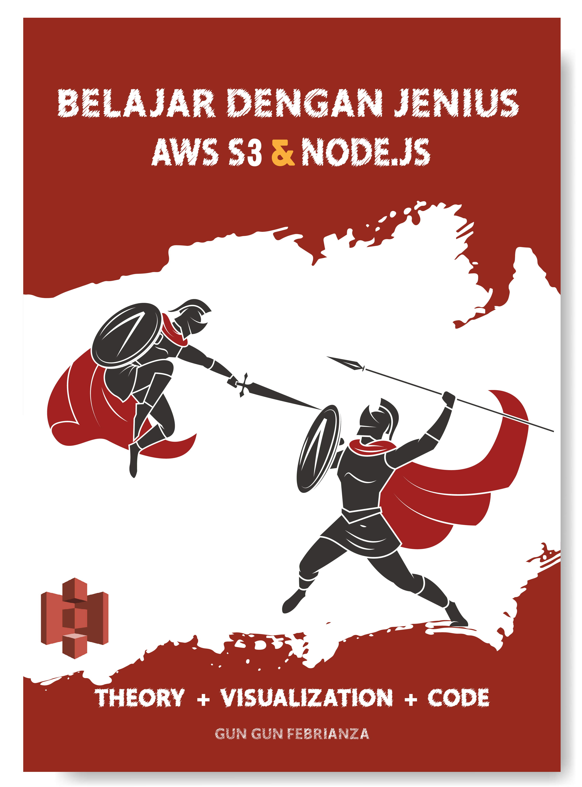

# Belajar Dengan Jenius AWS S3
## Karya : Gun Gun Febrianza
### Published in 2020
### Learn AWS S3 on Youtube : [Belajar AWS S3 Bahasa Indonesia](https://www.youtube.com/watch?v=WhO6kJfYeMU)

## Open Library Indonesia

### Table of Contents

-----------

### Chapter 1 - AWS CLI

#### Subchapter 1 - AWS CLI V1 & V2

1. Command Line Interface (CLI)
   - Linux Shell
   - Windows Command Line
   - Remote
2. AWS CLI V2
   - Install AWS CLI V2 on Linux
   - Install AWS CLI V2 on Windows
   - Install AWS CLI V2 on MacOS
3. AWS CLI V1
   1. Install AWS CLI
   2. Upgrade AWS CLI
   3. Verify AWS CLI

#### [Tentang Penulis](https://github.com/gungunfebrianza/Belajar-Dengan-Jenius-AWS-S3-JS/blob/master/Tentang%20Penulis.md)

## Todo

- [x] All Example in Go Language