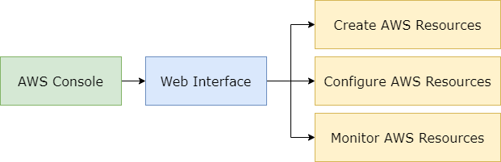
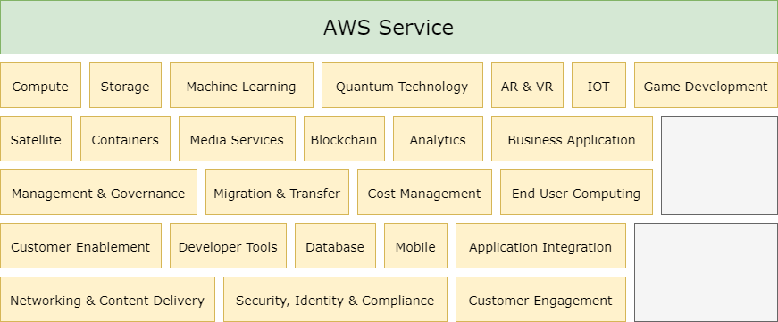
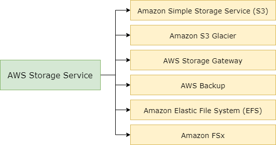

# Belajar Dengan Jenius AWS S3 & Node.js

## Penulis : Gun Gun Febrianza

## Subchapter 1 - *AWS Management Console*

Setelah kita selesai membuat Akun pada **Amazon Web Service (AWS),** kita akan dibawa menuju halaman login agar bisa masuk untuk mengelola **AWS Management Console**. Akun pertama yang kita miliki disebut dengan **Root Account**.

Seluruh fungsi yang ada di dalam **Amazon Web Service (AWS)** memiliki **API** yang dapat kita akses melalui **management console** pada **web** dan **mobile app** untuk **iOS** dan **Android**. 

Melalui **AWS Management Console** atau **AWS Console** kita dapat berinteraksi melalui **web interface** yang disediakan untuk mengelola **AWS Resources**. Di bawah ini adalah tampilan halaman **dashboard** dari **AWS Console Management** :

Pada buku ini kita membahas penggunaan layanan **Amazon Simple Storage System (S3)** yang merupakan salah satu layanan yang berada di dalam **Storage**. 

Saat ini **Cloud Storage** adalah salah satu komponen penting dalam **Cloud Computing**, tempat menyimpan informasi untuk menjalankan sebuah aplikasi seperti : 

1. **Big Data Analytics**,

2. ***Data Warehouses,*** 

3. ***Internet of Things*** atau 

4. ***Backup*** dan ***archive*** sangat tergantung pada tempat penyimpanan data. 

---------------------

