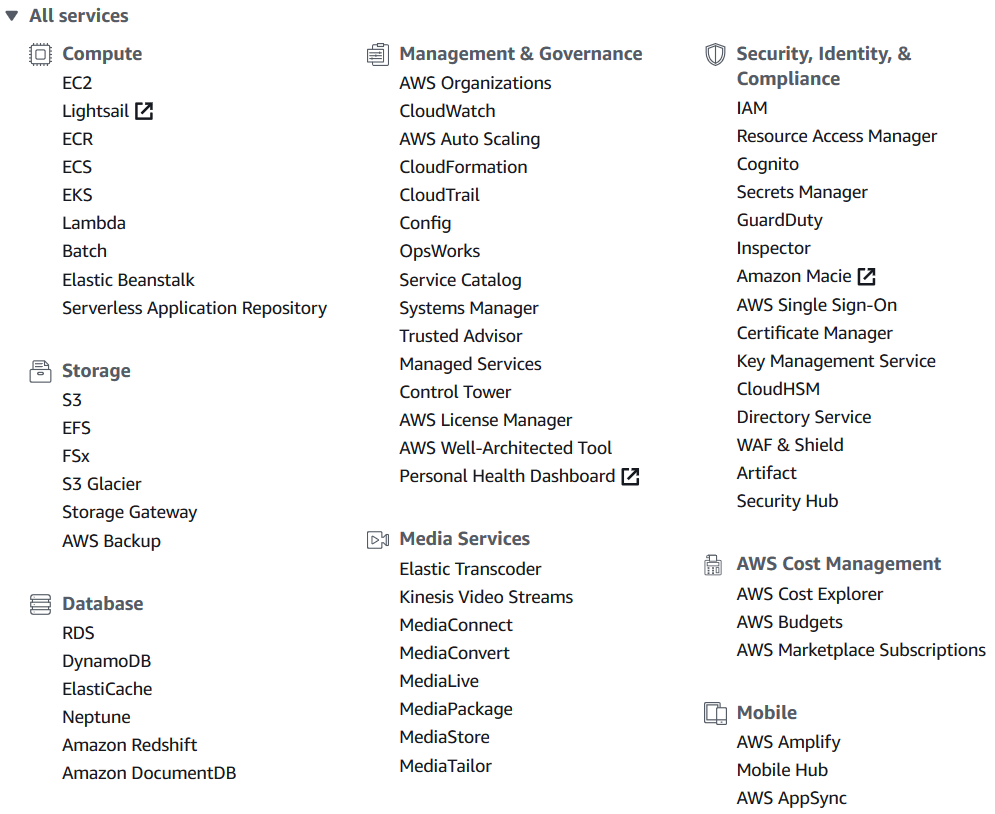

# Belajar Dengan Jenius AWS S3 & Node.js

## Penulis : Gun Gun Febrianza

# Chapter 1 - Amazon Web Service

Sebelum menggunakan layanan ***Amazon Web Services\*** pastikan anda membuat akun *AWS* terlebih dahulu. Kunjungi Halaman *AWS* [*Click here*](https://aws.amazon.com/). 

Untuk tutorial bagaimana cara mendaftarkan akun di AWS, silahkan baca tutorial [*Click here*](https://aws.amazon.com/premiumsupport/knowledge-center/create-and-activate-aws-account/).

*AWS* menyediakan layanan yang sangat luas seperti layanan komputasi *(compute),* penyimpanan *(storage), databases, networking, analytics, machine learning* dan *artificial intelligence (AI), Internet of Things (IoT), security* dan masih banyak lagi. Layanan yang memberikan ***non-stop solution\*** untuk menggunakan *product AWS*. 

*Cloud* *Service Provider* menyediakan sekumpulan teknologi yang bisa diakses melalui ***Web Portal\***, fungsi dari *web portal* sebagai *interface* untuk mengendalikan infrastruktur yang dimiliki oleh *cloud service provier*. 

Saat ini penulis mengandalkan *Amazon Web Service* sehingga penulis bisa berbagi pengalaman kepada pembaca melalui *Dashboard AWS* penulis. Saat buku ini ditulis *AWS* memiliki 165 layanan yang bisa kita gunakan. Di bawah ini adalah kumpulan teknologi yang dimiliki oleh *AWS* :

Ketika anda memasuki **Dashboard AWS** atau sering disebut **AWS Management Console** maka anda akan melihat menu tersebut.

---------------------

