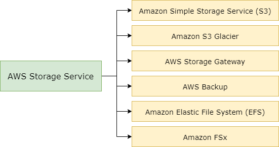

# Belajar Dengan Jenius AWS S3 & Node.js

## Penulis : Gun Gun Febrianza

## Subchapter 1 - *AWS Management Console*

Pada buku ini kita membahas penggunaan layanan **Amazon Simple Storage System (S3)** yang merupakan salah satu layanan yang berada di dalam **Storage**. 

Saat ini **Cloud Storage** adalah salah satu komponen penting dalam **Cloud Computing**, tempat menyimpan informasi untuk menjalankan sebuah aplikasi seperti : 

1. ***Big Data Analytics***,

2. ***Data Warehouses,*** 

3. ***Internet of Things*** atau 

4. ***Backup*** dan ***Archive*** sangat tergantung pada tempat penyimpanan data. 

---------------------

